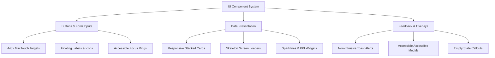

# 🎨 Comprehensive UI/UX Redesign & Improvement Recommendations
**SPECTROPY School Portal & Educational Management System**
*Mobile-First, Modern SaaS Design Architecture & Usability Strategy*

---

## 📋 Executive Summary

This document presents an end-to-end, deeply researched UI/UX audit and redesign strategy for the **SPECTROPY School Portal** frontend application (`RA-PORTAL-FRONTEND`). Based on a comprehensive review of the React codebase (including authentication, multi-role dashboards, OMR exam processing, class/teacher management, and analytics reporting), this strategy establishes a production-ready roadmap to transform the current portal into a world-class, mobile-first SaaS web application.

---

## 🔍 1. Current UI Analysis

### 1.1 Existing Strengths
* **Rich Multi-Persona Feature Coverage**: The application caters to six distinct user personas (Spectropy Admin, School Owner, Teacher, Student, Parent, and Guest), with tailored data views for each.
* **Data Visualization Integration**: Integrates `recharts` for performance visualization (bar charts for subject scores, trend lines for test series).
* **Comprehensive Export Capabilities**: Features built-in PDF export (`jspdf-autotable`), Excel downloading (`xlsx`), and bulk ZIP packaging (`jszip`, `file-saver`) across tables and reports.
* **Structured Data Models**: Clear hierarchy connecting Schools → Academic Years → Classes & Sections → Teachers & Students → OMR Exams & Subject Scores.

### 1.2 Existing Weaknesses
* **Styling Fragmentation**: Design is split between global CSS (`src/styles.css`) and inline JavaScript style objects in individual components (`Dashboard.jsx`, `LoginPage.jsx`, `SchoolOwnerDashboard.jsx`). This leads to style duplication, inconsistent color definitions, and layout bugs.
* **Color Inconsistencies**: Multiple conflicting primary blues are used across the codebase (e.g., `#1a56db` in app header, `#0ea5e9` in global CSS, `#1e90ff` in dashboard tabs & login tiles, `#4299e1` in badges).
* **Non-Standardized Layout Containers**: Inconsistent max-widths (`1120px` in CSS vs `1200px` in JS) and hardcoded spacing, causing container alignment shifts when switching tabs.
* **Heavy Table Density on Mobile**: Tables (`SchoolTable`, `ExamsRegistration`, `OMRUploadView`) rely on horizontal scrolling with fixed column counts rather than responsive stacked card patterns for viewports under 768px.
* **Form Feedback Anti-Patterns**: Relies on browser-native `alert()` dialogs (e.g. `SchoolForm.jsx`) and plain red text elements (`crimson` / `#e3342f`) instead of inline validation messages, toast notifications, or banner alerts.

### 1.3 UX Pain Points
* **Tab Overflow on Small Screens**: Top navigation in `Dashboard.jsx` uses a single horizontal scroll strip with 6 tabs. On mobile, tab labels overflow, hide current context, and lack quick-swipe indicators.
* **Multi-Step Login Friction**: `LoginPage.jsx` forces users through nested step states (`loginStep`) with separate back buttons, inconsistent input placeholders, and rigid casing rules (e.g., auto-converting uppercase school IDs without visible caps formatting).
* **Deep Nested Navigation inside Dashboards**: `SchoolOwnerDashboard.jsx` handles 4 view states (`overview`, `batch`, `class-section`, `class-section-exam`) within a single 2500+ line component, leading to slow page renders, lost scroll positions, and hidden back actions.
* **Lack of Loading Skeletons**: Data fetching across dashboards shows plain `<p>Loading...</p>` text, creating layout shifts (CLS) when content resolves.
* **Manual School ID Calculation**: `SchoolForm.jsx` requires manual state selection and 2-digit number entry to generate IDs like `TS2501`, but lacks live validation against existing school codes during typing.

### 1.4 Accessibility (a11y) Issues
* **Low Contrast Text Ratios**: Text colors such as `#4682b4` (steel blue) on `#f0f8ff` (alice blue background) in `LoginPage.jsx` yield a contrast ratio of ~3.2:1, failing WCAG 2.1 AA standards (minimum 4.5:1).
* **Missing Keyboard Focus Indicators**: Custom clickable `<div>` tiles and tab buttons omit explicit outline/focus-visible styling for keyboard users navigating via Tab key.
* **Non-Semantic HTML Elements**: Dynamic clickable cards and table rows rely on `onClick` on non-interactive elements without proper `role="button"`, `tabIndex={0}`, or ARIA state attributes (`aria-selected`, `aria-expanded`).
* **Icon-Only Buttons Without Labels**: Password visibility toggle (`🙈`/`👁️`) and modal close buttons lack screen-reader accessible `aria-label` tags or readable tooltips in certain components.

### 1.5 Inconsistent Design Patterns
| UI Element | Current Variations across Codebase | Proposed Standardized Pattern |
| :--- | :--- | :--- |
| **Border Radius** | `6px`, `8px`, `12px`, `14px`, `20px` | `radius-sm` (6px), `radius-md` (10px), `radius-lg` (16px), `radius-full` (9999px) |
| **Primary Color** | `#1a56db`, `#0ea5e9`, `#1e90ff`, `#0284c7` | Design Token `--color-primary-600` (`#0284c7` / `#2563eb`) |
| **Font Family** | `ui-sans-serif, system-ui...` mixed with `-apple-system` | Inter / Plus Jakarta Sans via CSS variable |
| **Card Padding** | `12px`, `16px`, `18px`, `20px`, `36px` | `padding-4` (16px) on Mobile, `padding-6` (24px) on Desktop |
| **Buttons** | Custom CSS class `.btn` vs inline `style={{ background: "#ef4444" }}` | Component library `<Button variant="primary|secondary|danger|ghost" size="sm|md|lg">` |

---

## 🎯 2. Design Goals

### 2.1 Overall Design Vision
To build a **sleek, modern, high-density educational management SaaS platform** that feels responsive, reliable, and delightful across all devices. The application will leverage modern visual aesthetics—clean typography, crisp border hierarchies, subtle drop shadows, and purposeful micro-interactions.

### 2.2 Target User Experience
* **For Admins & School Owners**: Comprehensive executive data visualization, instant searching, quick-action data tables, and batch report downloads.
* **For Teachers**: Rapid, error-free OMR score uploading, class performance filtering, and instant student PDF report generation.
* **For Students & Parents**: Friendly, clear, card-based test summaries, rank badges, subject strength indicators, and downloadable progress reports.

### 2.3 Mobile-First Philosophy
* Design for **360px–430px viewports first**, then progressively adapt to tablets (768px+) and desktop monitors (1024px–1440px+).
* Primary mobile actions positioned within the **natural thumb-zone** (lower half of the screen).
* Convert complex multi-column tables into **stacked mobile card layouts** with expandable detail drawers.

### 2.4 Key Usability Improvements
1. **Zero Layout Shift (CLS)**: Skeleton state loaders for all asynchronous data queries.
2. **Contextual Global Toasts**: Toast notifications replacing native `alert()` and red error texts.
3. **Sticky Navigation Bar & Mobile Drawer**: Header bar stays fixed; tab navigation shifts to a thumb-accessible bottom bar or mobile drawer.
4. **Optimized Form Controls**: Custom dropdowns, floating label inputs, and smart auto-complete inputs.

---

## 📱 3. Screen-by-Screen Recommendations

### 3.1 Screen 1: Login & Role Selection (`LoginPage.jsx`)
* **Current Issues**:
  * Role selection grid displays 6 text-heavy tiles that look inconsistent on small viewports.
  * Multi-step role logins require full container re-renders.
  * Low color contrast (`#4682b4` on `#f0f8ff`).
  * Hardcoded credential check logic visible in UI source code.
* **Proposed Improvements**:
  * Redesign into a split-screen login layout (Desktop: visual illustrations/branding on left, form card on right; Mobile: top brand badge + compact role selector pill tab).
  * Direct tabbed toggle between "Role Portal" and "Admin Access" without multi-step screen flashing.
  * Input fields with floating labels, clear leading icons (user icon, key icon, school icon), and accessible password show/hide toggles.
* **Layout & Responsive Behavior**:
  * Mobile (<640px): Single card centered, vertical stack of roles or horizontal role slider.
  * Desktop (≥1024px): 2-column grid layout with branded sidebar featuring school stats or platform highlights.

---

### 3.2 Screen 2: Admin Dashboard & School Management (`Dashboard.jsx`, `SchoolForm.jsx`, `SchoolTable.jsx`)
* **Current Issues**:
  * Top navigation tabs scroll horizontally with no visible visual scroll indicators or sticky behavior.
  * `SchoolForm.jsx` fields are cramped on mobile screens (`grid-2` and `grid-3`).
  * `SchoolTable.jsx` breaks on mobile due to 10 wide columns requiring awkward horizontal scrolling.
  * Delete actions rely on native `window.confirm()`.
* **Proposed Improvements**:
  * **Navigation**: Replace raw overflow div with a modern segmented tab bar on desktop and a bottom navigation dock on mobile.
  * **School Form**: Convert into a structured 2-column card with clear group headings ("General Information", "Location Details", "Identification Code"). Add live auto-generated preview badge for `SCHOOL_ID`.
  * **School Table**: Implement a hybrid view—Data Table on desktop vs **Interactive Card Cards** on mobile with expandable accordions for Classes and Teachers.
  * **Action Modals**: Replace `window.confirm()` with a custom, accessible **Destructive Action Modal**.
* **Layout & Responsive Behavior**:
  * Desktop: Full data grid with sticky header and floating action buttons (FAB) for school creation.
  * Mobile: Filter search bar fixed to top; schools displayed as swipeable summary cards with status pills.

---

### 3.3 Screen 3: School Owner Dashboard (`SchoolOwnerDashboard.jsx`)
* **Current Issues**:
  * Contains over 2500 lines of code handling 4 deep view states without browser history integration (Back button exits page).
  * Metrics cards are plain text without visual icons, trend arrows, or comparative percentage badges.
  * Deep nested tables for class sections and student lists suffer from dense padding.
* **Proposed Improvements**:
  * Extract view states into distinct sub-route components (`/owner/overview`, `/owner/class/:id`, etc.) using React Router.
  * Upgrade metric cards with KPI widgets featuring metric icons, trend indicators (+5% vs last test), and micro sparkline charts.
  * Add a persistent Breadcrumb navigation bar (`Dashboard > Grade 10-A > Week Test 3`) at the top of the viewport.
  * Provide quick filter pills for Academic Year, Program (CAT, MAE, PIO), and Exam Type.
* **Responsive Behavior**:
  * Convert overview stats grid from 4-column desktop to 2x2 grid on tablet and single column on mobile.

---

### 3.4 Screen 4: Teacher Dashboard (`TeacherDashboard.jsx`)
* **Current Issues**:
  * Complex analytical calculations (`computeExamAnalytics`) run inside render cycles.
  * PDF generation locks UI thread without visual progress bar.
  * Subject percentage metrics lack color-coded threshold badges (e.g. Green >75%, Amber 50-74%, Red <50%).
* **Proposed Improvements**:
  * Add color-coded status badges for subject test score averages.
  * Provide a dedicated **"Upload OMR Results" Quick Action Card** directly at the top of the teacher dashboard.
  * Implement async worker progress modal when batch-generating PDF reports.
  * Add student search filter within class performance views.

---

### 3.5 Screen 5: Student & Parent Dashboards (`StudentDashboard.jsx`, `ParentDashboard.jsx`)
* **Current Issues**:
  * High duplication between Student and Parent dashboard files (~800 lines each of near-identical code).
  * Score comparison charts (`recharts`) cut off x-axis labels on mobile screens (<400px).
  * Print/Download PDF buttons are hidden at the bottom of long pages.
* **Proposed Improvements**:
  * Refactor into a unified component (`StudentParentPortal.jsx`) accepting a `viewMode="parent" | "student"` prop.
  * **Hero Performance Banner**: Display overall percentile, overall percentage badge, and class rank prominently at the top.
  * **Mobile Chart Optimization**: Render charts inside responsive containers with rotated x-axis labels or toggleable tabular summaries for mobile screen readers.
  * **Sticky Action Bar**: Position "Download Report Card (PDF)" as a primary floating button at the bottom right of the screen on mobile devices.

---

### 3.6 Screen 6: Class & Teacher Registration (`ClassTeacherRegistration.jsx`)
* **Current Issues**:
  * Long form scrolling with multiple dense sections (Add Class, Add Teacher, Assign Teacher).
  * Multi-select and dropdown inputs (e.g. foundation selection, program selection) lack clear visually grouped section cards.
  * Teacher assignment badges display raw text strings (`GRADE-10 • A • Physics`).
* **Proposed Improvements**:
  * Split registration into a 3-step Wizard pattern: `Step 1: Classes & Sections` → `Step 2: Teacher Profiles` → `Step 3: Subject Allotments`.
  * Display allotted teacher badges as interactive tags with direct "Remove" (`✕`) click targets.
  * Add instant validation preventing assignment of duplicate teachers to the same class/subject.

---

### 3.7 Screen 7: OMR Exams & LMS Converter (`ExamsRegistration.jsx`, `LMSExamRegistration.jsx`, `OMRUploadView.jsx`)
* **Current Issues**:
  * OMR pattern lists display long text lists of 18+ tests (Week Test 1 to 18) without collapsible groupings.
  * File drag-and-drop zone in `OMRUploadView.jsx` is small and lacks explicit visual upload cues (dragover highlight).
  * Error messages during file upload render as raw text lines below inputs.
* **Proposed Improvements**:
  * Group exam patterns into expandable accordions by category (`Part Tests`, `Week Tests`, `Unit Tests`, `Grand Tests`).
  * Redesign file upload into a large, thumb-friendly **Drag-and-Drop Dropzone Box** featuring file extension icons (`.csv`, `.xlsx`), file size indicators, and a upload progress bar.
  * Provide instant client-side CSV column verification before sending payloads to backend endpoints.

---

### 3.8 Screen 8: Queries & Guest Page (`QueriesPage.jsx`, `GuestPage.jsx`)
* **Current Issues**:
  * `QueriesPage.jsx` relies on basic standard form fields with minimal visual structure.
  * `GuestPage.jsx` feels bare and disconnected from the core product experience.
* **Proposed Improvements**:
  * **Queries Page**: Turn into an interactive Help Desk ticket interface with category chips ("Marking Issue", "OMR Discrepancy", "General Query"), file attachment options, and ticket status trackers (Open, In Progress, Resolved).
  * **Guest Page**: Upgrade into a dynamic **Interactive Product Tour / Demo Dashboard** with sample data toggles and a clear CTA banner ("Contact Spectropy Admin to Activate Your School").

---

## 🎨 4. Visual Design System

### 4.1 Typography Hierarchy
* **Primary Font Family**: `Inter`, `-apple-system`, `BlinkMacSystemFont`, `Segoe UI`, `Roboto`, `sans-serif`.
* **Monospace Font (IDs & Codes)**: `JetBrains Mono`, `Fira Code`, `ui-monospace`, `monospace`.

| Scale Name | Size (px / rem) | Line Height | Weight | Usage |
| :--- | :--- | :--- | :--- | :--- |
| **Display Heading** | 32px / 2.0rem | 1.2 | 700 (Bold) | Dashboard Main Hero Titles |
| **Heading 1 (H1)** | 24px / 1.5rem | 1.3 | 700 (Bold) | Page Headers, Section Lead Titles |
| **Heading 2 (H2)** | 20px / 1.25rem | 1.35 | 600 (SemiBold) | Card Titles, Modal Headers |
| **Heading 3 (H3)** | 16px / 1.0rem | 1.4 | 600 (SemiBold) | Form Group Headers, Table Titles |
| **Body Base** | 14px / 0.875rem | 1.5 | 400 (Regular) | Table Cells, Form Labels, Paragraphs |
| **Body Small** | 12px / 0.75rem | 1.5 | 400 / 500 | Badges, Helper Text, Table Captions |
| **Micro Tag** | 10px / 0.625rem | 1.4 | 600 (Bold) | Status Tags, Uppercase Category Pills |

---

### 4.2 Color Palette (Design Tokens)

```css
:root {
  /* Brand Primary Colors (Professional Slate Blue Theme) */
  --primary-50: #eff6ff;
  --primary-100: #dbeafe;
  --primary-200: #bfdbfe;
  --primary-500: #3b82f6;
  --primary-600: #2563eb; /* Core Primary */
  --primary-700: #1d4ed8;
  --primary-900: #1e3a8a;

  /* Neutral Slate Palette */
  --color-bg: #f8fafc;
  --color-surface: #ffffff;
  --color-surface-hover: #f1f5f9;
  --color-border: #e2e8f0;
  --color-border-strong: #cbd5e1;
  --color-text-main: #0f172a;
  --color-text-muted: #64748b;
  --color-text-subtle: #94a3b8;

  /* Semantic Feedback Colors */
  --success-bg: #f0fdf4;
  --success-border: #bbf7d0;
  --success-text: #15803d;

  --warning-bg: #fffbeb;
  --warning-border: #fde68a;
  --warning-text: #b45309;

  --danger-bg: #fef2f2;
  --danger-border: #fecaca;
  --danger-text: #b91c1c;

  --info-bg: #f0f9ff;
  --info-border: #bae6fd;
  --info-text: #0369a1;
}
```

---

### 4.3 Spacing System (8px Grid Scale)
All layout padding, margins, and gaps will strictly adhere to an **8px grid scale** (with 4px micro-spacing):

```css
--space-1: 4px;   /* Micro gaps, badge padding */
--space-2: 8px;   /* Small gaps, button vertical padding */
--space-3: 12px;  /* Compact card padding, field gap */
--space-4: 16px;  /* Standard container gap, mobile screen margin */
--space-6: 24px;  /* Desktop card padding, section spacing */
--space-8: 32px;  /* Large section gap */
--space-12: 48px; /* Page layout vertical gap */
```

---

### 4.4 Elevation & Shadows

```css
--shadow-sm: 0 1px 2px 0 rgba(15, 23, 42, 0.05);
--shadow-md: 0 4px 6px -1px rgba(15, 23, 42, 0.08), 0 2px 4px -2px rgba(15, 23, 42, 0.05);
--shadow-lg: 0 10px 15px -3px rgba(15, 23, 42, 0.1), 0 4px 6px -4px rgba(15, 23, 42, 0.05);
--shadow-focus: 0 0 0 3px rgba(37, 99, 235, 0.25);
```

---

### 4.5 Component Style Specifications

#### Buttons
* **Height**: `44px` (Touch standard) on Mobile; `38px` on Desktop.
* **Padding**: `12px 20px`.
* **Border Radius**: `8px` (`var(--radius-md)`).
* **States**: Normal, Hover (`filter: brightness(0.95)`), Active (`transform: scale(0.98)`), Focus (`outline: var(--shadow-focus)`), Disabled (`opacity: 0.5; cursor: not-allowed`).

#### Cards
* **Background**: `var(--color-surface)`.
* **Border**: `1px solid var(--color-border)`.
* **Border Radius**: `12px`.
* **Shadow**: `var(--shadow-sm)` on rest; `var(--shadow-md)` on hover for interactive cards.

#### Tables
* **Header Background**: `var(--color-bg)` with uppercase text (`fontSize: 11px`, `fontWeight: 600`, `letterSpacing: 0.5px`).
* **Row Height**: Minimum `44px` for touch accessibility.
* **Row Hover**: `background: #f8fafc`.
* **Borders**: Light subtle bottom border `1px solid #f1f5f9`.

---

## 🛠️ 5. Component-Level Detailed Improvements



### 5.1 Buttons & Inputs
* **Standardized Variants**: Primary, Secondary, Outline, Ghost, Destructive (Danger).
* **Input Fields**: Include clear helper text below, invalid error state with red border + exclamation icon, and clean focus ring.

### 5.2 Modals & Overlays
* Modal overlays must feature backdrop blur (`backdrop-filter: blur(4px)`), smooth fade-in animation, `Esc` key listeners, and focused trap management.

### 5.3 Loaders & Empty States
* **Skeleton Screens**: Render pulse animations mimicking card/table structures while data resolves.
* **Empty States**: Custom SVG illustration, clear description ("No schools found matching your search"), and a primary CTA ("Add New School").

---

## 🖐️ 6. Mobile Experience Strategy

1. **Thumb-Zone Optimization**: Place key action buttons (e.g. Save, Upload OMR, Export PDF) within easy reach of the right thumb.
2. **Bottom Navigation Bar**: On mobile viewports (<768px), move main tabs to a fixed bottom navigation bar:
   * 🏠 Home / Overview
   * 🏫 Schools / Classes
   * 📝 Exams / OMR
   * 🔍 Search & Queries
3. **Gesture Support**:
   * Swipe right/left to switch between active dashboard tabs.
   * Pull-to-refresh on student report cards and school tables.
4. **Touch Target Guarantee**: Enforce minimum target sizes of **44×44px** on all clickable buttons, icon toggles, and select options.

---

## ⚡ 7. User Flow & Productivity Improvements

```
[Old Flow: School Addition]
Login -> Role Select -> Admin Portal -> Manual Form Typing -> Click Add -> Native Alert Window -> Refresh Table -> Manual Check ID

[New Streamlined Flow]
Login -> Direct Admin Dashboard -> Quick Add School Modal -> Smart Auto-fill State Code & ID Preview -> Live Duplicate Check -> Instant Table Update with Success Toast
```

* **Click Reduction**: Reduce clicks needed to access student exam reports from 4 clicks down to 2 clicks via quick search auto-complete.
* **Streamlined OMR Upload**: Single-step drag-and-drop with instant parsing feedback rather than separate select, inspect, and submit steps.

---

## ♿ 8. Accessibility (a11y) & WCAG Compliance Checklist

- [x] **WCAG 2.1 AA Contrast**: Ensure text elements achieve minimum contrast ratio of 4.5:1 against background colors.
- [x] **Focus Management**: Visible focus rings (`box-shadow: 0 0 0 3px rgba(37, 99, 235, 0.4)`) on all interactive inputs and buttons.
- [x] **Keyboard Accessibility**: Full keyboard nav support (`Tab`, `Shift+Tab`, `Enter`, `Space`, `Escape`).
- [x] **Screen Reader Landmark Roles**: Proper semantic tags (`<header>`, `<main>`, `<nav>`, `<footer>`, `<aside>`).
- [x] **ARIA State Indicators**: Include `aria-expanded`, `aria-selected`, `aria-controls`, and `aria-live="polite"` for asynchronous notifications.

---

## 🚦 9. Actionable Priority Implementation Roadmap

### 🔴 High Priority (Immediate Fixes - Week 1 to 2)
* [ ] **Unify CSS Tokens**: Replace inline color objects across all components with global CSS variable design tokens (`src/styles.css`).
* [ ] **Replace Native `alert()` Calls**: Integrate a modern toast library (e.g. `react-hot-toast` or custom Toast component) for form feedback.
* [ ] **Fix Color Contrast**: Update low-contrast text elements (`#4682b4`) on login and dashboard cards to meet 4.5:1 ratio.
* [ ] **Add Skeleton Loaders**: Replace raw `<p>Loading...</p>` text with animated skeleton card/table placeholders.
* [ ] **Enforce 44px Touch Targets**: Enlarge touch targets on mobile buttons and tab switches.

### 🟡 Medium Priority (Enhancements - Week 3 to 4)
* [ ] **Refactor Multi-Role Navigation**: Create a responsive top navigation bar (desktop) + bottom dock (mobile) for dashboard switching.
* [ ] **Implement Mobile Card Tables**: Add responsive layout to `SchoolTable.jsx` and `OMRUploadView.jsx` switching tables to stacked cards under 768px.
* [ ] **Refactor Student/Parent Dashboard Duplication**: Merge shared logic into a single reusable `StudentParentPortal.jsx`.
* [ ] **Add Destructive Action Modals**: Replace `window.confirm()` during school/class deletion with an accessible dialog.

### 🟢 Low Priority (Polish & Micro-Interactions - Week 5+)
* [ ] **Add Framer Motion Page Transitions**: Smooth fade-and-slide transitions between dashboard tabs.
* [ ] **Interactive Product Tour for Guest Mode**: Upgrade `GuestPage.jsx` with sample data toggles and visual banners.
* [ ] **Chart Mobile Controls**: Add horizontal pan/zoom and tabbed data view switches for Recharts components on small viewports.

---

## 📦 10. Implementation & Architecture Notes

### Recommended Technical Stack Additions
* **CSS Framework / Styling**: Tailwind CSS or CSS Modules using standard Design Tokens.
* **Component Primitives**: Radix UI or Headless UI (for unstyled accessible dialogs, dropdowns, and tabs).
* **Icons**: `lucide-react` (clean, lightweight SVG icon system).
* **Toast Notifications**: `react-hot-toast` or `sonner`.
* **Animations**: `framer-motion` for micro-interactions and layout transitions.

### Performance & Virtualization
* **Table Virtualization**: Integrate `@tanstack/react-virtual` for school and student tables exceeding 100+ items to guarantee 60fps scrolling.
* **Chart Lazy Loading**: Dynamic import (`React.lazy`) for heavy Recharts modules to minimize initial bundle loading time on mobile networks.

---
*End of UI/UX Recommendation Document. Prepared for the SPECTROPY Engineering Team.*
